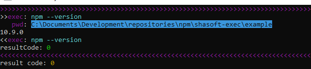

## Запуск сторонних программ

### Подключение
```js
const exec = require("terminal-exec");
```

### Запуск с получением кода возврата результата выполнения команды
Запуск `npm --version` для вывода версии
```js
const rc = exec('npm')              // Команда для запуска
    .args(['--version'])            // Аргументы
    .pwd(__dirname)                 // Рабочая директория
    .env('ADD_ENV_PATH', __dirname) // Добавить переменную среды
    .show(true)                     // Выводить результата работы на экран
    .run();
console.log('result code:', rc);
```


### Запуск с получением данных, выводимых командой на консоль
Запуск `npm --version` для получения версии в веде строки
```js
const version = exec('npm') // Команда для запуска
    .arg('--version')       // Добавить аргумент
    .asString(true)         // Возвращать не код возврата, а строку, 
                            // которую программа вывела в результате работы
    .show(true)             // Выводить результата работы на экран
    .run();
console.log('npm version:', version);
```
